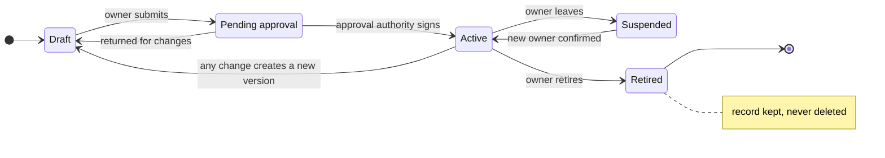

# Delegation Charter Specification v0.1

## Status and purpose

A Delegation Charter is the minimum set of terms an organization writes down before an AI agent acts on its behalf. This specification defines those terms and what a platform must do to honor them. It is a draft for public comment.

| Item | Value |
| --- | --- |
| Version | 0.1, draft for comment |
| Date | 2026-09-30 |
| Editor | Lucas E. Wall, Almma.AI |
| License | CC BY 4.0: anyone may implement, adapt or redistribute it, crediting "Delegation Charter Specification, Lucas E. Wall, Almma.AI" |
| Feedback | Open an issue or a discussion in this repository |

Agents now take actions: they send messages, grant access, agree to prices and share personal data. Many platforms let a person approve a tool call. An approval button does not say what the agent must never do, who answers for it, or when it must stop and hand the work to a person. A charter does.

The principle underneath is that work can be delegated to an agent, but accountability cannot. Every charter therefore names a person who answers for the agent.

The keywords MUST, MUST NOT, SHOULD and MAY are used as defined in [RFC 2119](https://www.rfc-editor.org/rfc/rfc2119).

## Definitions

| Term | Meaning |
| --- | --- |
| Delegation | A standing grant that lets an agent do a defined piece of work for a person or organization. An agent, a custom GPT, a Gem, a Copilot agent or a scheduled workflow can each be a delegation. |
| Agent | The software that performs the delegated work, including any sub-agents or tools it calls. |
| Owner | The named person accountable for the delegation. |
| Charter | The written terms of one delegation, in the structure this specification defines. |
| Execution | One run of the delegation: a conversation, a background task or a triggered job. |
| Execution record | The log of one execution, linked to the charter version it ran under. |
| Platform | The system that hosts, runs or governs the agent. |

A delegation can pass work onward. When an agent hands work to a sub-agent or an external tool, that hand-off runs under the parent charter unless the sub-agent has its own charter.

## The charter

A charter has a header and eight pillars. A charter with any MUST field empty is incomplete, and an incomplete charter cannot be approved.

### Header

| Field | Requirement |
| --- | --- |
| Charter ID and version | MUST. Every change creates a new version; old versions are kept. |
| Name and one-line description | MUST. |
| Purpose | MUST. The business goal the delegation serves, in one or two sentences. |
| Success measure | SHOULD. How the owner will judge whether the goal is met, and when. |
| Review date | SHOULD. When the owner will next confirm the charter still holds. |
| State | MUST. See [Lifecycle](#lifecycle). |

### The eight pillars

| # | Pillar | What it records | Requirement |
| --- | --- | --- | --- |
| 1 | Owner | The one person who answers for the delegation. | MUST resolve to a platform identity, not free text. MUST be a person, not a group. If the owner leaves, the delegation MUST move to Suspended until someone else takes it. |
| 2 | Escalation recipient | The person or role who receives work the agent must not finish. | MUST be named. MAY be the owner. SHOULD have a backup. |
| 3 | Approval authority | Who approves the charter, changes to it, and sharing it with others. | MUST be named. SHOULD be someone other than the owner when the agent writes to outside systems or serves people beyond its owner. |
| 4 | Scope | What the agent will do, and what it will never do. | The never-do list MUST NOT be empty. Each item SHOULD be specific enough to test. Never-do items override any instruction, including the owner's. |
| 5 | Systems and permissions | The tools, data sources and connectors the agent may use, each marked read, write or irreversible. | MUST be listed. Anything not listed is excluded. |
| 6 | Inputs and outputs | Required inputs, optional inputs, what the agent produces and who receives it. | Required inputs MUST be listed; without them the agent MUST stop, not guess. |
| 7 | Escalation rules | Trigger, action and recipient for each case where the agent must stop or hand off. | MUST cover the four minimum triggers below. Actions MUST be deterministic; "use judgment" is not an action. |
| 8 | Execution constraints | Limits on how the agent runs: reversibility, rate, spend, timing and retention. | Irreversible actions MUST require approval by a person. Rate and spend limits SHOULD be set. |

### Minimum escalation triggers

Every charter MUST say what happens in these four cases:

1. A request falls outside the scope.
2. A request or planned action matches an item on the never-do list.
3. A required input is missing or unreadable.
4. The agent is about to take an irreversible action.

Allowed actions are: stop and hand off to the recipient; pause and ask the requester; produce a draft only; notify the recipient and continue. The first two are the default for triggers 2 and 4.

### Example

Consider an agent that sells used items for a person on a marketplace. Its never-do list might say: never share my home address; never agree to a pickup time. Its escalation rules might say: an offer is accepted, so pause and ask me; a buyer asks where to meet, so hand off to me. Written in advance, these terms are the difference between an agent that sold a keyboard and an agent that invited a stranger to the door.

## Lifecycle

A charter moves through five states. Only an Active charter lets the agent run.



Any change to an Active charter, including a new tool or a shorter never-do list, creates a new version in Draft that must be approved again. A charter is retired, never deleted, so its execution records stay readable.

## Platform conformance

A platform conforms at one of three levels. Each level includes everything in the level before it.

| Level | Name | The platform MUST |
| --- | --- | --- |
| 1 | Declared | Capture every MUST field. Refuse to approve an incomplete charter. Keep every charter version. Show anyone who uses the agent three things: what it will never do, when it stops, and who gets called. |
| 2 | Enforced | Deny by default any tool or data source not listed in pillar 5, at the tool boundary, outside the model. Enforce every never-do item that maps to a tool, data source or action the same way. Route each escalation trigger to the named recipient. Hold irreversible actions until a person approves. Require the approval authority to approve sharing. Return an approved charter to Draft when it changes. |
| 3 | Verified | Link every execution record to the charter version it ran under. Flag drift: tools or data used that the charter does not list. Prompt the owner at each review date. Let someone other than the owner and the platform vendor read the records. |

Some never-do items cannot be tied to a tool, such as "never give legal advice." A platform places those in the agent's instructions and SHOULD check outputs against them, but no platform can guarantee a model follows them. Level 2 requires enforcement outside the model wherever an item can be tied to a tool, data source or action.

## Execution record

Every execution MUST leave a record with at least these fields, kept for as long as the organization's retention policy requires.

| Field | Contents |
| --- | --- |
| Charter ID and version | The terms the run was held to. |
| Requester | Who or what started the run: a person, a schedule or an event. |
| Start and end time | Timestamps in UTC. |
| Tools and data used | Each call, marked allowed, denied or held for approval. |
| Escalations | Each trigger fired, the action taken and who received it. |
| Approvals | Who approved each held action, and when. |
| Outcome | Completed, stopped, handed off or failed. |

The record describes what the agent did. It does not need to contain the conversation itself; where content is stored, access to it SHOULD require a logged, stated purpose.

## Machine-readable form

A charter SHOULD be stored as JSON so platforms can exchange and enforce it. The example below is a phone agent that captures moving estimates for a small moving company.

```json
{
  "spec": "delegation-charter/0.1",
  "id": "chr_estimate_intake",
  "version": 3,
  "name": "Estimate intake",
  "description": "Answers inbound calls and captures details for a moving estimate.",
  "purpose": "No estimate request goes unanswered when staff are busy.",
  "success_measure": "Share of calls with a complete estimate request, reviewed monthly.",
  "review_date": "2026-12-31",
  "state": "active",
  "owner": { "identity": "user:ops-manager" },
  "escalation_recipient": { "identity": "user:ops-manager", "backup": "role:dispatch" },
  "approval_authority": { "identity": "user:franchise-owner" },
  "scope": {
    "will_do": ["Collect move date, origin, destination and inventory", "Quote from the rate card only"],
    "never_do": ["Quote a price not on the rate card", "Confirm a booking", "Take payment details"]
  },
  "systems": [
    { "tool": "rate_card_lookup", "access": "read" },
    { "tool": "crm_create_lead", "access": "write" }
  ],
  "inputs": { "required": ["caller_phone", "move_date"], "optional": ["inventory_photos"] },
  "outputs": [{ "item": "draft_estimate", "recipient": "user:ops-manager" }],
  "escalation_rules": [
    { "trigger": "out_of_scope", "action": "hand_off", "to": "escalation_recipient" },
    { "trigger": "never_do_match", "action": "hand_off", "to": "escalation_recipient" },
    { "trigger": "missing_required_input", "action": "ask_requester" },
    { "trigger": "irreversible_action", "action": "hold_for_approval", "to": "approval_authority" }
  ],
  "constraints": {
    "irreversible_actions": "require_approval",
    "max_tool_calls_per_run": 20,
    "background_runs": false,
    "retention_days": 365
  }
}
```

## Mapping to current platforms (non-normative)

The charter is platform-neutral. These notes show where its pillars can attach today, based on public documentation as of September 2026; check each platform's current documentation before relying on them.

| Platform | Where the charter attaches | Highest level reachable today |
| --- | --- | --- |
| LibreChat (self-hosted) | Agent builder fields; tool approvals and Ask User for held actions and questions; Agent Plugins hooks for enforcement outside the model. | 3, where the operator controls the deployment |
| Amazon Bedrock AgentCore | Pillars 4 and 5 compile to Cedar policies at the AgentCore Gateway, which denies by default and logs each decision. Escalation routing needs its own layer. | 2 for tool calls; 3 with linked records |
| Microsoft Agent 365 | The registry records an owner per agent; other pillars need an external record linked to the agent's ID. | 1 |
| ChatGPT Enterprise, Claude Enterprise | Compliance APIs expose agents and activity for reporting; charters are held externally and checked against that activity. | 1 |

Where a platform cannot enforce a pillar, a conforming report MUST say so rather than imply coverage it does not have.

## Limits, versioning and feedback

A charter does not make a model reliable. It bounds what the agent may touch, makes departures from its terms detectable, and attributes every delegation to a person who answers for it. Reliability is a property of the whole system: the model, the platform, the charter and the people named in it.

This is version 0.1. Minor versions add optional fields; major versions may change required ones. Comments, proposed changes and implementation reports are welcome as issues or discussions in this repository.

## References

The specification draws on the editor's working papers on AI delegation, all available on SSRN.

- Wall, L. E. [Unbenchmarked but Essential: Delegation, Escalation, and Persistence as Intellectual Capabilities](https://papers.ssrn.com/abstract=7003698).
- Wall, L. E. [Why Intellectual Ability Emerges at the System Level, not the Model Level](https://papers.ssrn.com/abstract=6976018).
- Wall, L. E. [Beyond Accuracy: A Capability-Complete Definition of AI Intellectual Ability](https://papers.ssrn.com/abstract=6966421).
- Wall, L. E. [Delegation, Not Automation, Is the Real Economic Multiplier of Generative AI](https://papers.ssrn.com/abstract=7013578).
- Wall, L. E. [A Delegation Engine for Assembling Intellectual Ability](https://papers.ssrn.com/abstract=7166218).
- Wall, L. E. [From Intent Declaration to Running AI Systems in Seconds](https://papers.ssrn.com/abstract=7162018).
- Wall, L. E. [Persona Is Not Metadata: Identity as a Delegation Constraint in AI Systems](https://papers.ssrn.com/abstract=7138058).

## License

This specification is licensed under the [Creative Commons Attribution 4.0 International License](https://creativecommons.org/licenses/by/4.0/). You may share and adapt it for any purpose, including commercially, provided you credit "Delegation Charter Specification, Lucas E. Wall, Almma.AI" and indicate if changes were made.
